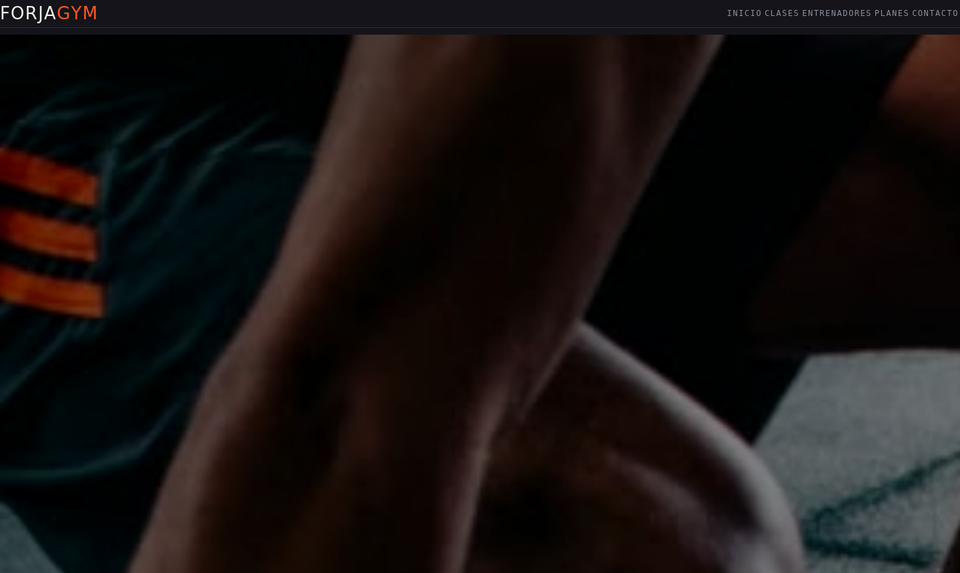
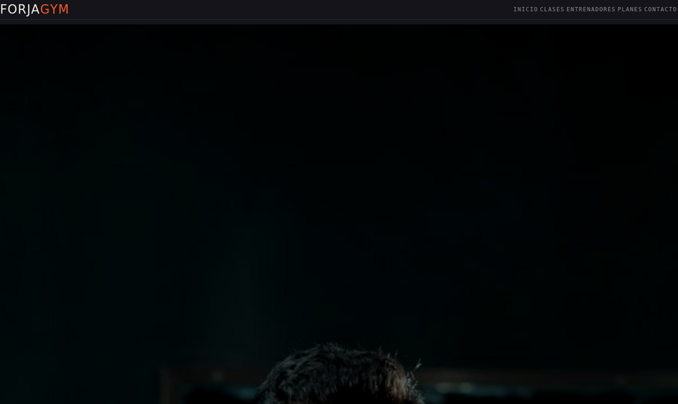
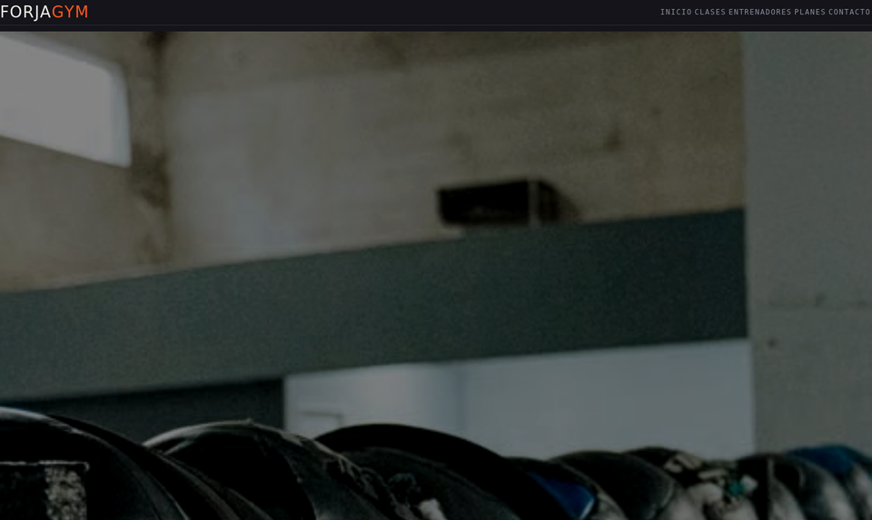
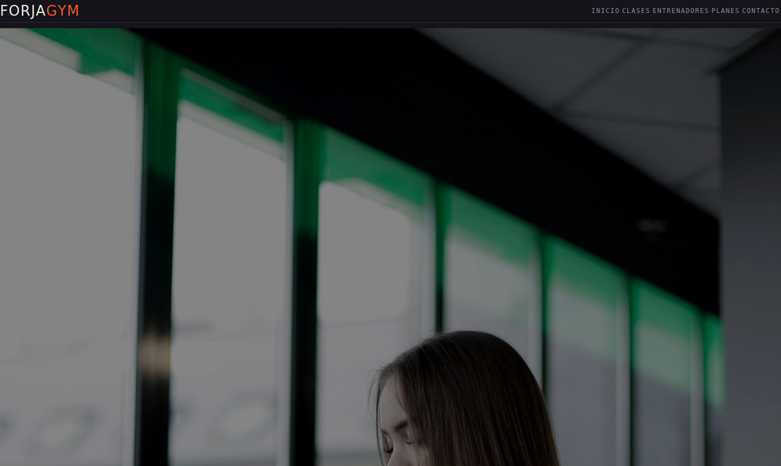

# Forja Gym — Proyecto web (HTML + CSS + JS + PHP + MySQL)

Aplicación web de ejemplo para un gimnasio, con 5 páginas HTML, una hoja de
estilos compartida, **un único formulario** de inscripción y un backend en
PHP que guarda la información en una base de datos MySQL. Las fotografías
son reales (banco Pexels) y viven localmente en `assets/img/fotos-reales/`,
así que el sitio se ve completo **sin conexión a internet**.

## Vista previa

| Portada | Clases | Entrenadores |
|---|---|---|
|  |  |  |

| Planes | Contacto |
|---|---|
|  |  |

## ⚠️ Si vas a subir esto a GitHub, lee esto primero

**GitHub (y GitHub Pages) solo sirve archivos estáticos: no puede ejecutar
PHP ni conectarse a una base de datos MySQL.** Si subes el proyecto tal
cual, cualquiera que entre al repositorio podrá:

- ✅ Ver todo el código (HTML, CSS, JS, PHP, el `.sql`) organizado y comentado.
- ✅ Ver las capturas de arriba directamente en la página del repositorio.
- ❌ **No podrá** llenar el formulario de inscripción, ni entrar al panel de
  administrador, ni ver el listado o imprimirlo — porque eso necesita un
  servidor PHP + MySQL corriendo, y GitHub no lo ofrece gratis.

### Cómo hacer que el profesor vea el proyecto funcionando de verdad

Tienes dos caminos, no son excluyentes:

**Opción A — Demostración en vivo (la más segura para la nota):**
Lleva tu proyecto corriendo en XAMPP en tu propia laptop (ver pasos de
instalación más abajo) y muéstraselo al profesor en persona o por
videollamada compartiendo pantalla. Así ve el flujo completo: inscripción →
panel admin → listado → imprimir. El repositorio de GitHub queda como
respaldo de que el código es tuyo y está bien organizado.

**Opción B — Subirlo a un hosting gratuito con PHP y base de datos:**
Si quieres que el profesor pueda entrar por su cuenta a un link y probarlo
sin que tú estés presente, tienes dos guías completas, paso a paso, según
qué hosting prefieras:

- **[`docs/DESPLIEGUE-INFINITYFREE.md`](docs/DESPLIEGUE-INFINITYFREE.md)** —
  hosting clásico con MySQL (cPanel-like, sin Docker).
- **[`docs/DESPLIEGUE-RENDER.md`](docs/DESPLIEGUE-RENDER.md)** — Render,
  vía Docker + PostgreSQL gratis (el proyecto ya trae el `Dockerfile`,
  `entrypoint.sh` y `render.yaml` necesarios).

El backend (`backend/api/conexion.php` y los archivos que usan la base de
datos) ya está preparado para funcionar automáticamente con **cualquiera**
de los dos motores (MySQL o PostgreSQL) sin que tengas que tocar el código
— solo cambian las variables de conexión según dónde lo despliegues.

## Estructura del proyecto

```
gym/
├── index.html                    ACCESO DIRECTO — redirige automáticamente a paginas/index.html
├── Dockerfile                     Para desplegar en Render (PHP no es nativo ahí, necesita Docker)
├── entrypoint.sh                  Ajusta Apache al puerto que Render asigne
├── render.yaml                    Blueprint: crea el servicio web + la base Postgres juntos
│
├── paginas/                      Las 5 páginas del sitio (el navegador las abre desde aquí)
│   ├── index.html                  Página principal
│   ├── clases.html                 Horario semanal completo + descripción de cada disciplina
│   ├── entrenadores.html           Perfiles, metodología de trabajo
│   ├── planes.html                 Comparación de planes + ÚNICO formulario de inscripción (#formulario)
│   └── contacto.html               Ubicación, horarios, cómo llegar
│
├── assets/                       Todo lo estático: estilos, scripts, íconos y fotos
│   ├── css/
│   │   └── style.css               Estilos globales + animaciones (afecta las 5 páginas)
│   ├── js/
│   │   └── script.js                Menú móvil, scroll-reveal, contador animado, envío AJAX a PHP
│   ├── svg/                        24 ilustraciones e íconos locales (sin internet)
│   │   ├── hero-*.svg                Ilustración de fondo de cada hero (una por página)
│   │   ├── icon-*.svg                Íconos de línea (mancuerna, cronómetro, check, etc.)
│   │   └── illus-*.svg               Ilustraciones de línea usadas en tarjetas puntuales
│   └── img/
│       └── fotos-reales/            13 fotografías reales (Pexels), uso 100% offline
│           └── LEEME.md               Detalle de cada foto: autor, dónde se usa, enlace de origen
│
├── backend/                     Todo el servidor: API, panel admin y base de datos
│   ├── api/
│   │   ├── conexion.php            Conexión vía PDO — detecta sola si usar MySQL (local/InfinityFree)
│   │   │                            o PostgreSQL (Render, según DATABASE_URL)
│   │   └── guardar_registro.php    Inserta el ÚNICO formulario en la tabla `socios`
│   ├── admin/                     Panel de administración (Listado + Imprimir)
│   │   ├── login.php / procesar_login.php / logout.php / auth.php
│   │   ├── panel.php                 Dashboard con conteo de inscripciones
│   │   ├── listado_socios.php        Tabla completa de socios + botón Imprimir
│   │   └── css/admin.css             Estilos del panel + reglas @media print
│   ├── setup/
│   │   └── inicializar.php         Crea las tablas en Render con solo visitar la URL (una vez)
│   └── database/
│       ├── gimnasio.sql            Esquema MySQL — para XAMPP local o InfinityFree
│       └── postgres.sql            Esquema PostgreSQL equivalente — para Render
│
├── docs/                        Documentación adicional del proyecto
│   ├── ESTRUCTURA.md               Explica por qué está organizado así, y en detalle el acceso directo
│   ├── DESPLIEGUE-INFINITYFREE.md  Guía paso a paso: hosting gratuito con MySQL
│   ├── DESPLIEGUE-RENDER.md        Guía paso a paso: Render con Docker + PostgreSQL
│   └── capturas/                   Screenshots de las 5 páginas (para el README / vista previa)
│
└── README.md                    Este archivo
```

> El `index.html` de la raíz es un **acceso directo**: un archivo mínimo que
> redirige de inmediato a `paginas/index.html` (con `meta refresh` +
> JavaScript de respaldo, y un enlace visible por si ninguno de los dos
> corre). Existe porque cualquier servidor web abre por defecto el
> `index.html` que está en la raíz del proyecto — así, con solo entrar a
> `http://localhost/gym/`, el visitante cae automáticamente en el sitio
> real sin tener que escribir `/paginas/index.html` a mano.
>
> Las 5 páginas viven un nivel más adentro, en `paginas/`, y todas sus
> rutas a `assets/` y `backend/` usan `../` para apuntar un nivel arriba.
> Todo lo demás (estilos, scripts, imágenes, backend) sigue agrupado por
> función dentro de `assets/` y `backend/`. Ver `docs/ESTRUCTURA.md` para
> el detalle completo.

## Un solo formulario, toda la información esencial

Por diseño, **solo existe un formulario en todo el sitio**, ubicado en
`planes.html` (sección `#formulario`). Las demás páginas no tienen
formularios propios: cada una tiene un botón "Ir al formulario de
inscripción" que lleva ahí directamente.

Ese formulario reúne todo lo que el gimnasio necesita de un cliente nuevo:

- **Datos personales:** nombre, apellido, correo, teléfono, fecha de
  nacimiento, dirección, género.
- **Membresía:** plan elegido, nivel de experiencia, objetivo principal.
- **Preferencias (opcionales):** clase de interés, entrenador de
  preferencia, horario preferido, comentarios/lesiones.

Todo se guarda en una sola tabla, `socios`, en la base `forja_gym`.

## Instalación (con XAMPP / WAMP / MAMP)

1. Copia la carpeta `gym` dentro de `htdocs` (XAMPP) o `www` (WAMP).
2. Inicia Apache y MySQL desde el panel de control.
3. Abre phpMyAdmin (`http://localhost/phpmyadmin`) e importa el archivo
   `backend/database/gimnasio.sql`. Esto crea la base de datos `forja_gym`
   y sus tablas `socios` y `administradores`.
4. Si tu usuario/contraseña de MySQL no son `root` / (vacío), edita
   `backend/api/conexion.php` y ajusta `$DB_USER` y `$DB_PASS`.
5. Abre el sitio en el navegador: `http://localhost/gym/` (el acceso directo
   te lleva solo a `paginas/index.html`).

## Panel de administrador

**Acceso:** enlace "Acceso administrador" en el pie de cada página, o
directo en `backend/admin/login.php`.

**Credenciales de ejemplo** (creadas por `backend/database/gimnasio.sql`):
- Usuario: `admin`
- Contraseña: `forja2026`

Desde `backend/admin/panel.php` puedes ver cuántas inscripciones hay en
total, por plan y del día; `backend/admin/listado_socios.php` muestra la
tabla completa con un botón **Imprimir** que usa `window.print()` y reglas
`@media print` para dejar solo la tabla en la hoja impresa.

Cambia la contraseña de ejemplo en producción. Las contraseñas se guardan
como hash con `password_hash()` y se validan con `password_verify()`,
nunca en texto plano.

## Imágenes 100% locales

- Los íconos e ilustraciones de línea (`assets/svg/`) son código SVG
  propio: no dependen de ningún servicio externo. Puedes abrir cualquier
  `.svg` en un editor de texto para cambiar sus colores (usan la misma
  paleta que `assets/css/style.css`: carbón, acero y acento "brasa").
- Las fotografías (`assets/img/fotos-reales/`) son reales, de uso gratuito
  (banco Pexels, sin atribución obligatoria), y ya están descargadas en
  formato JPEG dentro del proyecto — el sitio no necesita internet para
  mostrarlas. Ver `assets/img/fotos-reales/LEEME.md` para el detalle de
  autor y ubicación de cada una.

## Diseño y animaciones

- Paleta industrial: carbón `#14141a`, acero `#1f2128`, acento ember
  `#ff5722`, hueso `#f2efe9`.
- Tipografía Bebas Neue (títulos) + Inter (cuerpo) + Roboto Mono (datos),
  cargada desde Google Fonts (si no hay internet, el navegador usa una
  tipografía de respaldo del sistema; el resto del sitio no se ve afectado).
- Animaciones: aparición progresiva de secciones al hacer scroll
  (`.reveal`, con `IntersectionObserver`), franja de datos en movimiento
  (`.ticker`), tarjetas que se elevan al pasar el mouse, contador animado
  en las estadísticas del hero y una franja de peligro (`hazard`) que se
  desliza suavemente. Todas las animaciones respetan
  `prefers-reduced-motion`.

## Cómo subir este proyecto a GitHub

1. Crea un repositorio nuevo en https://github.com/new (puede ser público
   o privado; si es privado, invita al profesor como colaborador).
2. En tu PC, abre una terminal **dentro de la carpeta `gym`** y ejecuta:
   ```
   git init
   git add .
   git commit -m "Primera entrega: Forja Gym"
   git branch -M main
   git remote add origin https://github.com/TU-USUARIO/TU-REPOSITORIO.git
   git push -u origin main
   ```
   (Reemplaza la URL por la de tu propio repositorio — GitHub te la muestra
   apenas lo creas, en el botón "Code").
3. Entra a la página del repositorio en GitHub: ya deberías ver las
   capturas de la sección "Vista previa" de este mismo README, además de
   todo el código organizado en carpetas.
4. Recuerda lo de la sección de arriba: el profesor puede **leer y
   revisar** el proyecto desde GitHub, pero para **probarlo funcionando**
   (inscribirse, entrar al panel, imprimir el listado) necesita que corra
   con PHP + MySQL — ya sea en tu demo en vivo o en un hosting con soporte
   PHP.
